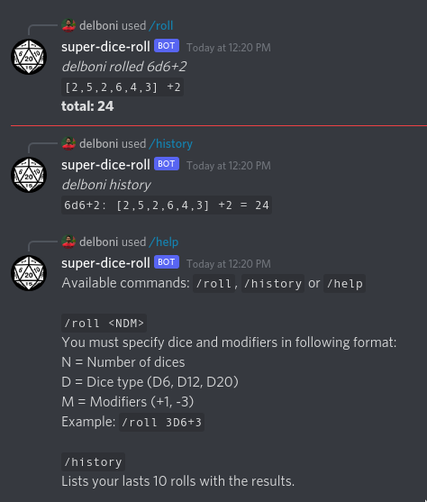

# Bot: Super Dice Roll

**Discord** and **Telegram** bot that roll dices using using commands like `/roll 4d6+4`.

[](https://discord.com/api/oauth2/authorize?client_id=861964097700757534&permissions=2148005952&scope=bot%20applications.commands)
[](https://telegram.me/superdiceroll_bot)

## Usage
- `/help`    Show available commands and how to use them.
- `/roll`    Roll dices. Example: `/roll 3D6+3`.
- `/history` Lists your lasts 10 rolls with the results.



# Developers

## About this code
 - **super-dice-roll**: Bot code for interaction via webhooks and rolling dices.

- [parenthesin/components](https://github.com/parenthesin/components): Helpers and component wrappers to give a foundation to create new services in clojure,
you can find components for database, http, webserver and tools for db migrations.

## Available Endpoints

Verb | URL                           | Description
-----| ----------------------------- | ------------------------------------------------
POST | /discord/webhook              | Receives Discord's [interaction object](https://discord.com/developers/docs/interactions/slash-commands#interaction-object)
POST | /telegram/webhook/{bot-token} | Receives Telegram's [update object](https://core.telegram.org/bots/api#update)

## Configure the config.edn 
Set the [`resources/config.edn`](https://github.com/rafaeldelboni/super-dice-roll-clj/blob/main/resources/config.edn) with your keys or the corresponding enviroment variables.  

## Docker
Start containers with postgres `user: postgres, password: postgres, hostname: db, port: 5432`  
and [pg-admin](http://localhost:5433) `email: pg@pg.cc, password: pg, port: 5433`
```bash
docker-compose -f docker/docker-compose.yml up -d
```
Stop containers
```bash
docker-compose -f docker/docker-compose.yml stop
```

## Running the server
First you need to have the database running, for this you can use the docker command in the step above.

### Repl
You can start a repl open and evaluate the file `src/super_dice_roll/server.clj` and execute following code:
```clojure
(start-system! (build-system-map))
```

### Uberjar
You can generate an uberjar and execute it via java in the terminal:
```bash
# genarate a target/service.jar
clj -T:build uberjar
# execute it via java
java -jar target/service.jar
```

## Repl
To open a nrepl
```bash
clj -M:nrepl
```
To open a nrepl with all test extra-deps on it
```bash
clj -M:test:nrepl
```

## Run Tests
To run unit tests inside `./test/unit`
```bash
clj -M:test :unit
```
To run integration tests inside `./test/integration`
```bash
clj -M:test :integration
```
To run all tests inside `./test`
```bash
clj -M:test
```
To generate a coverage report 
```bash
clj -M:test --plugin kaocha.plugin/cloverage
```

## Lint
Runs LSP to fix format and namespaces
```bash
clojure -M:clojure-lsp format
clojure -M:clojure-lsp clean-ns
```
Runs LSP to check format and namespaces
```bash
clojure -M:clojure-lsp format --dry
clojure -M:clojure-lsp clean-ns --dry
clojure -M:clojure-lsp diagnostics
```

## Migrations
To create a new migration with a name
```bash
clj -M:migratus create migration-name
```
To execute all pending migrations
```bash
clj -M:migratus migration
```
To rollback the latest migration
```bash
clj -M:migratus rollback
```
See [Migratus Usage](https://github.com/yogthos/migratus#usage) for documentation on each command.

## Directory Structure
```
./
├── .clj-kondo -- clj-kondo configuration and classes
├── .github
│   └── workflows -- Github workflows folder.
├── docker -- docker and docker-compose files for the database
├── resources -- Application resources assets folder and configuration files
│   └── migrations -- Current database schemas, synced on service startup.
├── src -- Library source code and headers.
│   ├── parenthesin -- Source for common utilities and helpers.
│   └── super_dice_roll -- Source for the bot.
└── test -- Test source code.
    ├── integration -- Integration tests source (uses state-flow).
    │   ├── parenthesin -- Tests for common utilities and helpers.
    │   └── super_dice_roll -- Tests for bot.
    └── unit -- Unity tests source (uses clojure.test).
        ├── parenthesin -- Tests for common utilities.
        └── super_dice_roll -- Tests for bot.
```

## Other iterations
- https://github.com/rafaeldelboni/super-dice-roll
- https://github.com/rafaeldelboni/node-super-dice-roll

## License
This is free and unencumbered software released into the public domain.  
For more information, please refer to <http://unlicense.org>
